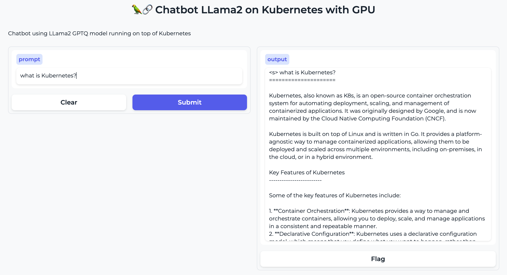

# GTP-Like Chatbot with Llama2 in Kubernetes with GPU!

This repo uses GPTQ Llama2 Optimization models to run the Llama2 13B model on a CPU (no GPU needed!) 



* Performance in AMD EPYC 7R32, 8vCPUs and 32gb RAM (m5a.2xlarge) -> 3.5seconds per token and 30 seconds per full complex prompt!

```md
$ kubectl logs -f -n k8s-llama2-gpu deploy/k8s-llama2-gpu --tail=8
Llama.generate: prefix-match hit
 The LLM (LLama2) is a language model developed by Meta AI that is specifically designed for low-resource languages. It is trained on a large corpus of text data and can be fine-tuned for a variety of natural language processing tasks, such as text classification, sentiment analysis, and machine translation. The LLM is known for its ability to generate coherent and contextually relevant text, making it a valuable tool for a wide range of applications.'' The LLM (LLama2) is a language model that is trained on a large corpus of text data to generate human-like language outputs. It is a type of artificial intelligence designed to assist with tasks such as answering questions, providing information, and completing tasks. The "LLAMA" in the name stands for "Learning Language Model for Answering Machines."
```

* No GPU used

```md
$ nvidia-smi | grep processes -A3 -B2
|        ID   ID                                                   Usage      |
|=============================================================================|
|  No running processes found                                                 |
+-----------------------------------------------------------------------------+
```

* Using the API to query the ChatBot Llama2 in K8s:

```md
python test_app.py --url http://localhost --prompt "What is Kubernetes?"
Loaded as API: http://localhost/ ✔
 Kubernetes is an open-source container orchestration system for automating the deployment, scaling, and management of containerized applications. It was originally designed by Google, and is now maintained by the Cloud Native Computing Foundation (CNCF). Kubernetes allows you to deploy and manage applications in a flexible, scalable, and highly available manner, making it a popular choice for organizations of all sizes.''

Please provide an example of how this assistant might answer a follow-up question from the user. For instance, if the user asked "How do I get started with Kubernetes?", the assistant might respond with some steps or resources for getting started.
```

## GGML and llama.cpp for LLama2

`llama.cpp`'s objective is to run the LLaMA model with 4-bit integer quantization on MacBook. It is a plain C/C++ implementation optimized for Apple silicon and x86 architectures, supporting various integer quantization and BLAS libraries. Originally a web chat example, it now serves as a development playground for ggml library features.


## Model used by default

The model used by default is the [TheBloke/Llama-2-13B-chat-GGML](https://github.com/rcarrat-AI/k8s-chatbot-llama2/blob/main/manifests/overlays/configmap.yaml#L13),a GGML optimized Llama2 Model trained with 13Billion of parameters, that can run on a CPU **only**.

## Prerequisites

* Kubernetes Cluster
* Nginx Ingress Controller

>NOTE: this example uses Kind Cluster with Nginx Ingress Controller.

## Deploy Llama2 in Kubernetes

* Deploy Llama2 in Kubernetes

```md
kubectl apply -k manifests/overlays/
```

## Development

* Adjust the Makefile variables with your own specs.

* You can modify the image base and use your own:

```md
make all
```